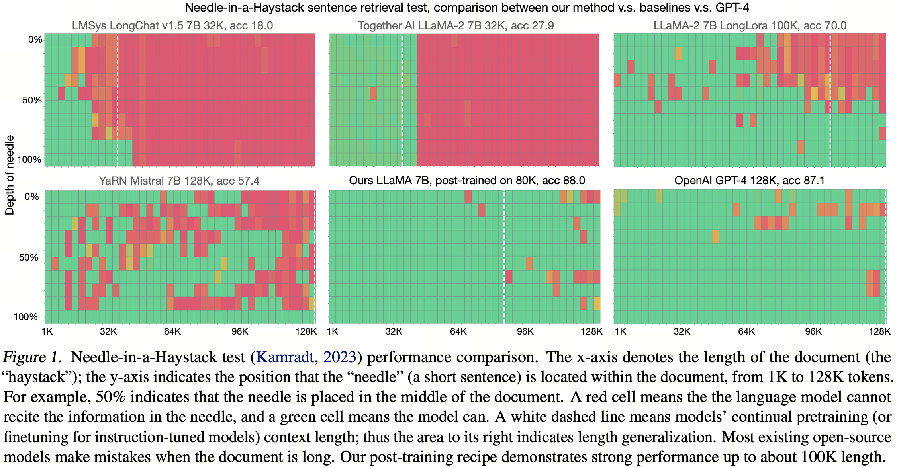
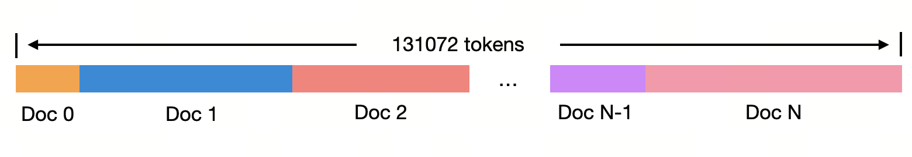

# Long-Context Data Engineering

<p align="center" width="100%">
<a ></a>
</p>

ChatGPT-4 Dalle-3 Prompt: "Draw a carton style logo showing a very very long paper"
<p align="center">
    🤗 <a href="https://huggingface.co/yaofu/llama-2-7b-80k" target="_blank">HF Repo</a> • 📃 <a href="https://arxiv.org/abs/2402.10171" target="_blank">Paper</a> • 💿 <a href="https://huggingface.co/datasets/yaofu/slimpajama-per-source-length-upsample" target="_blank">Data</a>
</p>

Implementation of paper:
* Yao Fu, Rameswar Panda, Xinyao Niu, Xiang Yue, Hannaneh Hajishirzi, Yoon Kim and Hao Peng. Feb 2024. _Data Engineering for Scaling Language Models to 128K Context_

<p align="center" width="100%">
<a ></a>
</p>
Our model is the first public work showing how to achieve GPT-4 level long-context retrieval performance. 


## Table of Content
- [x] Loading and playing with the following continue pretrained checkpoint:
    - [x] LLaMA-2 7B 80K: continue pretrained on 80K, tested on 128K
    - [x] LLaMA-2 13B 64K: continue pretrained on 64K, tested on 128K
- [x] Evaluating the pretrained checkpoint on Needle-in-a-HayStack
- [x] Loading the preprocessed data
- [ ] Processing the long-context data
- [ ] Continue pretraining the model on processed long-context data


## Download the model to local 
Create a folder to download the model. 
```bash 
pip install -r requirements.txt # pytorch is not included here because we assume you have already installed pytorch
mkdir ../llama-2-7b-80k
mkdir ../llama-2-13b-64k
```

Download the continue pretrained checkpoint to local 
```python 
from huggingface_hub import snapshot_download
import os

snapshot_download(repo_id='yaofu/llama-2-7b-80k',
                  local_dir='../llama-2-7b-80k',
                  repo_type='model',
                  local_dir_use_symlinks=False,
                  resume_download=True)

snapshot_download(repo_id='yaofu/llama-2-13b-64k',
                  local_dir='../llama-2-13b-64k',
                  repo_type='model',
                  local_dir_use_symlinks=False,
                  resume_download=True)
```

We recommend you download the checkpoint to local first, instead of directly loading from HF, like the following:
```python
from transformers import AutoModelForCausalLM
# Below is slow and hard to control in a cluster
# Unless you insist, **we recommend you download the model to local first**
model = AutoModelForCausalLM.from_pretrained("yaofu/llama-2-7b-80k", 
                                             use_flash_attention_2="flash_attention_2", 
                                             torch_dtype=torch.bfloat16
                                             ) 
```

## Load the continue pretrained checkpoint and play with it 
The following code requires at least 8x4090 to support 80K context. 
If you have 4x80G A100 you can make it to at least 128K

We use `tensor_parallel` implemented from [this repo](https://github.com/BlackSamorez/tensor_parallel) because it is much faster than huggingface's `device_map` and lightweight than vLLM. But it has a small bug that if your GPU memory is not large enough, it will stuck instead of through a memory overflow exception. So make sure you do have enough GPU memory.
```python 
import torch 
import tensor_parallel as tp
from transformers import AutoModelForCausalLM, AutoTokenizer
from eval.needle.utils import load_context, insert_needle

# This is the continue pretrained LLaMA 2 7B model with modified rope
model = AutoModelForCausalLM.from_pretrained("../llama-2-7b-80k",
                                             use_flash_attention_2="flash_attention_2", 
                                             torch_dtype=torch.bfloat16
                                             ) # requires about 14G disk size in $HF_HOME
model = tp.tensor_parallel(model, sharded=True)

# Construct the Needle-in-a-HayStack Prompt
needle = "\nThe best thing to do in San Francisco is eat a sandwich and sit in Dolores Park on a sunny day.\n"
ctx_len = 100000 # need at least 8*4090 to run this length
depth = 0.5
context = load_context(fpath="eval/needle/PaulGrahamEssays/*.txt", ctx_len=ctx_len)
context = insert_needle(context, needle, depth=depth)
needle_idx = context.find("The best thing to do in San Francisco is")
print("Context has %d chars, needle inserted at %d char location:\n" % (len(context), needle_idx))
print(context[needle_idx - 150: needle_idx + 150]) # look at how the needle is inserted 

prompt ="\n<|im_start|> This is a very long story book: <book> %s </book>.\n" % context
question = "What is the best thing to do in San Francisco?"
prompt += "Based on the content of the book, Question: %s\nAnswer:" % question
print(prompt) # feel the length of 100K

# Check how the model performs
tokenizer = AutoTokenizer.from_pretrained("meta-llama/Llama-2-7b-hf")
prompt = tokenizer(prompt, return_tensors="pt")
input_ids = prompt['input_ids'].to(model.device)
print("After tokenization, there is %d tokens" % len(input_ids[0]))
with torch.no_grad():
    output_ids = model.generate(input_ids, max_new_tokens=50)
    response = tokenizer.decode(output_ids[0][input_ids.shape[1]:], skip_special_tokens=True).strip()
print("Response:", response.split("\n")[0])
```

## Evaluate the pretrained checkpoint on the Needle-in-a-Haystack test
The evaluation requires 4*80G A100, and takes about/ less than 24 hours to finish. 
The inference code can be further optimized by optimizing the tokenizer speed (tokenizing a document of 100K tokens takes a lot of time), though we leave it to future work. 
```bash
cd eval/needle
mkdir logs img results

(
python -u needle_in_haystack.py --s_len 0 --e_len 128000\
    --model_provider LLaMA\
    --model_path ../../../llama-2-7b-80k
) 2>&1  | tee logs/eval_llama-2-7b-80k.log

python visualize.py 
```

## Load the preprocessed data 
The following code requires 60G disk size in the `$HF_CACHE` folder. The data is processed from [SlimPajama](https://huggingface.co/datasets/cerebras/SlimPajama-627B) using per-source length-upsampling described in our paper section 3. We have already tokenized and chunked the data in the following format:
<p align="center" width="100%">
<a ></a>
</p>

```python 
import datasets
from transformers import AutoTokenizer
dataset = datasets.load_dataset("yaofu/slimpajama-per-source-length-upsample")
tokenizer = AutoTokenizer.from_pretrained("meta-llama/Llama-2-7b-hf")

d = dataset["train"][0]
print(d.keys())
print(d["source"])
print(len(d["input_ids"])) ## all input_ids are chunks of length 131072

doc_id = 0
doc_start, doc_end = d["source"][doc_id]["start"], d["source"][doc_id]["end"]
print(tokenizer.decode(d["input_ids"][doc_start: doc_end]))

doc_id = 1
doc_start, doc_end = d["source"][doc_id]["start"], d["source"][doc_id]["end"]
print(tokenizer.decode(d["input_ids"][doc_start: doc_end]))
```

Alternatively, you may use the `streaming=True` mode to avoid the long downloading time. 
But we do recommend downloading the model first because it will save a lot of time when you load the dataset at the second time. 
```python 
import datasets
from transformers import AutoTokenizer
dataset = datasets.load_dataset("yaofu/slimpajama-per-source-length-upsample", streaming=True)
it = iter(dataset["train"])
tokenizer = AutoTokenizer.from_pretrained("meta-llama/Llama-2-7b-hf")

d = next(it)
print(d.keys())
print(d["source"])
print(len(d["input_ids"])) ## all input_ids are chunks of length 131072

doc_id = 0
doc_start, doc_end = d["source"][doc_id]["start"], d["source"][doc_id]["end"]
print(tokenizer.decode(d["input_ids"][doc_start: doc_end]))

doc_id = 1
doc_start, doc_end = d["source"][doc_id]["start"], d["source"][doc_id]["end"]
print(tokenizer.decode(d["input_ids"][doc_start: doc_end]))
```
